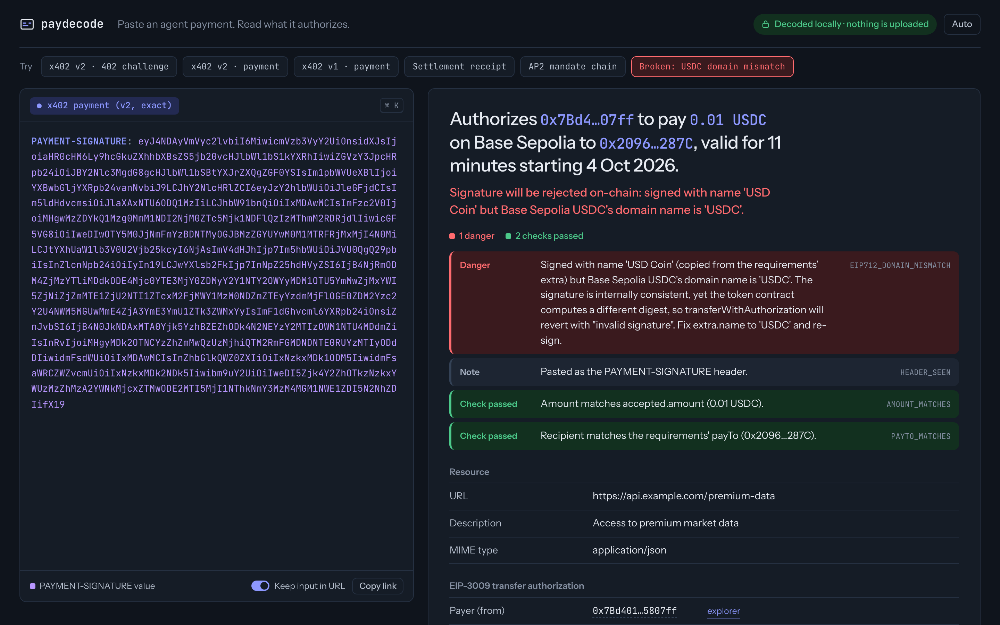
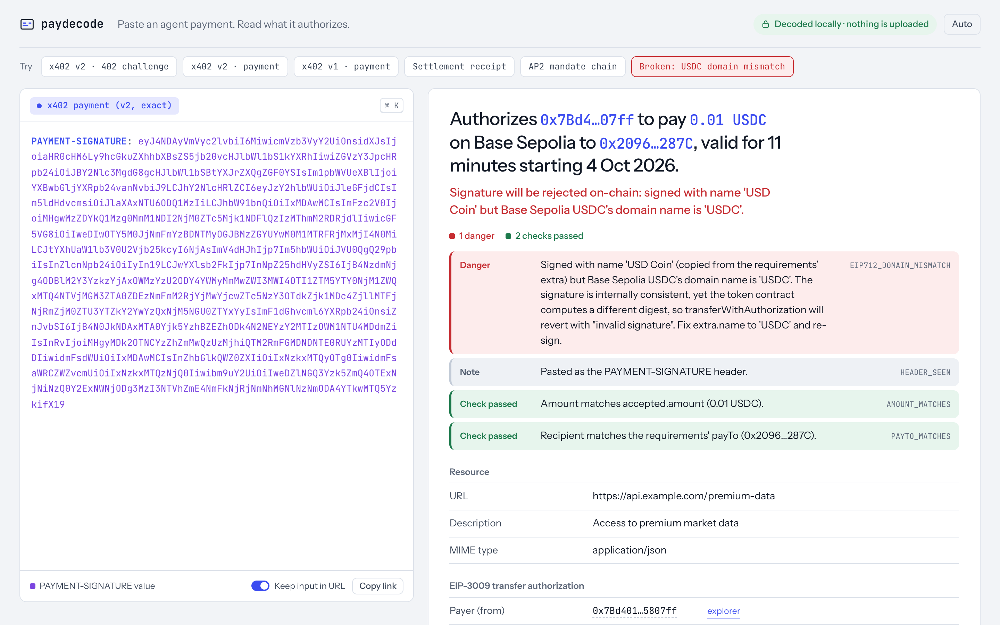
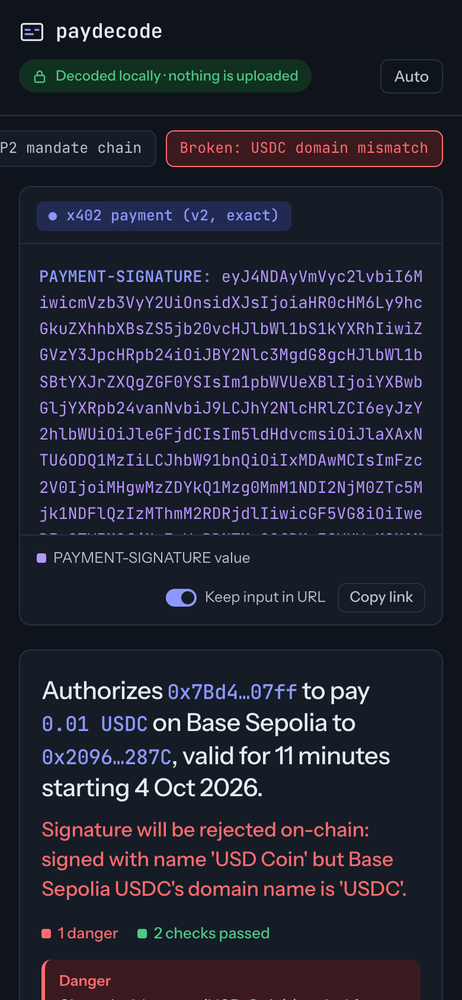

# paydecode web

The browser front end for [paydecode](../packages/paydecode): jwt.io for agent payments. Paste an x402 header, an AP2 mandate, an EIP-3009 authorization or a Solana payment transaction and read what it authorizes in plain English, with risk flags. Everything decodes in the tab.



| Light                                         | Mobile                                             |
| --------------------------------------------- | -------------------------------------------------- |
|  |  |

## Quickstart

From the repository root (Node 20.19 or newer; checked on Node 22.14):

```sh
npm install
npm run dev -w web        # http://localhost:5173
```

## Scripts

Run from the repo root with `-w web`, or from inside `web/` without it.

| Script                    | What it does                                                             |
| ------------------------- | ------------------------------------------------------------------------ |
| `dev`                     | Vite dev server with hot reload.                                         |
| `build`                   | `tsc -b` typecheck, then a production build into `web/dist`.             |
| `preview`                 | Serves `web/dist` locally, to check the production build.                |
| `typecheck`               | `tsc -b` only.                                                           |
| `lint`                    | ESLint (flat config, type-aware `typescript-eslint`, React hooks rules). |
| `format` / `format:check` | Prettier write / check.                                                  |

The web build does not need `packages/paydecode/dist`: Vite and TypeScript both read the library from source (see below). `npm run build` at the root builds the library and the web app in order.

## Deploy

The output is a static site: `web/dist` is plain HTML, CSS and JS with no server code, no API routes and no environment variables. Any static host works.

Vercel (not set up yet) would be: root directory `web`, install command `cd .. && npm install`, build command `npm run build`, output directory `dist`. The canonical URL and Open Graph tags in `index.html` assume `https://paydecode.vercel.app/`; change them if the site lives elsewhere.

## Architecture

```
web/
  index.html              static shell: SEO tags, theme bootstrap, the "What paydecode reads" explainer and footer
  src/
    main.tsx              mounts <App/>
    App.tsx               layout, example picker, URL-hash sync, theme, keyboard shortcut
    components/
      Editor.tsx          transparent <textarea> over a color-coded <pre> mirror (jwt.io style)
      ResultView.tsx      summary, flag tally, findings, field sections, nested hops, raw JSON
      FieldRow.tsx        one decoded field: addresses, hashes, amounts, times with relative glosses
      Copyable.tsx        click-to-copy value
      RawJson.tsx         collapsible, syntax-colored decoder output
    lib/
      decoder.ts          thin wrapper over paydecode's decode()
      segments.ts         splits raw input into colored parts (header name, JWT parts, ~~ delegation hops)
      examples.ts         example artifacts, taken from the library's test fixtures
      brokenExample.ts    signs the "USDC domain mismatch" demo in the page
      networks.ts         chain ids and network names to block explorer links
      format.ts           relative-time glosses (from Field.unixSeconds), safe JSON
    types/paydecode.d.ts  re-exports the library entry point, for the web typecheck
```

**Decoding.** `decode()` from the `paydecode` package does all the protocol work: detecting the format, base64 and JWT parsing, EIP-712 hashing and signature recovery, AP2 constraint checks and Solana transaction parsing. The web app only presents its `Decoded` result: `title`, `summary`, `flags` (danger, warn, info, ok), `sections` of typed fields, `children` for delegation hops, and `raw`.

**Library from source.** `vite.config.ts` aliases `paydecode` to `packages/paydecode/src/index.ts`, and `tsconfig.app.json` maps it to `src/types/paydecode.d.ts`, which re-exports that same entry point. So the web app always runs and type-checks against the library's current code, with nothing copied that could drift. The library sources are therefore also checked under the web's compiler flags (`erasableSyntaxOnly`, `noUnusedLocals`), so keep library code within them.

**Lazy decoder.** The decoder and its crypto (`@noble/curves`, `@noble/hashes`) load as a separate chunk after first paint. The page renders and accepts input immediately, then decodes once the chunk arrives.

**The broken example.** "Broken: USDC domain mismatch" is the x402 v2 payment fixture with `accepted.extra.name` changed from `USDC` to `USD Coin`, then signed in the page under that wrong EIP-712 domain with a fresh 11-minute validity window. The only real problem on screen is the domain mismatch, which is the bug paydecode exists to catch: the signature is internally valid, but Base Sepolia USDC computes a different digest and `transferWithAuthorization` reverts. The signing key is derived from a public string (`keccak256("paydecode public demo key: holds nothing, never fund it")`); it is a throwaway that holds nothing. If in-page signing fails, the static fixture in `examples.ts` is used instead.

## Privacy model

- **Client-side only.** Input is decoded by JavaScript in your tab. The app makes no network request with your input: no API, no analytics, no error reporting. The only third-party request is the Google Fonts stylesheet, which carries no input.
- **Input lives in the URL hash, never the query string.** With "Keep input in URL" on (the default), the input is mirrored to `#i=<urlencoded input>`. Browsers do not send the fragment to servers, so it never reaches the host's access logs, and the static host has no code that could read it. The query string would be sent, so it is never used.
- **Shared links carry the input.** Anyone with the link sees the artifact, and the link stays in browser history. Turn off "Keep input in URL" before pasting anything you would not paste in a chat. The choice is remembered in `localStorage` (`paydecode:url-sync`), along with the theme (`paydecode:theme`). Nothing else is stored.
- **Decoding is not verification of intent.** paydecode reports what an artifact authorizes and what will make it fail; it does not check on-chain state such as balances, nonces already used or the live token contract. See the library README for its limitations.

## Accessibility

Every control is a native button, link or checkbox with a visible label. `Cmd/Ctrl+K` focuses the input. Focus is always visible (the editor shows a ring on its wrapper, since the textarea itself is transparent). Text meets WCAG AA contrast in both themes; this was checked with axe-core on the empty state and on several decoded examples in light and dark. Only the format chip is a live region, so screen readers hear "x402 payment (v2, exact)" rather than the whole result on every keystroke.

## License

MIT. Author: Agnij Dutta ([@0xholmesdev](https://x.com/0xholmesdev)).
